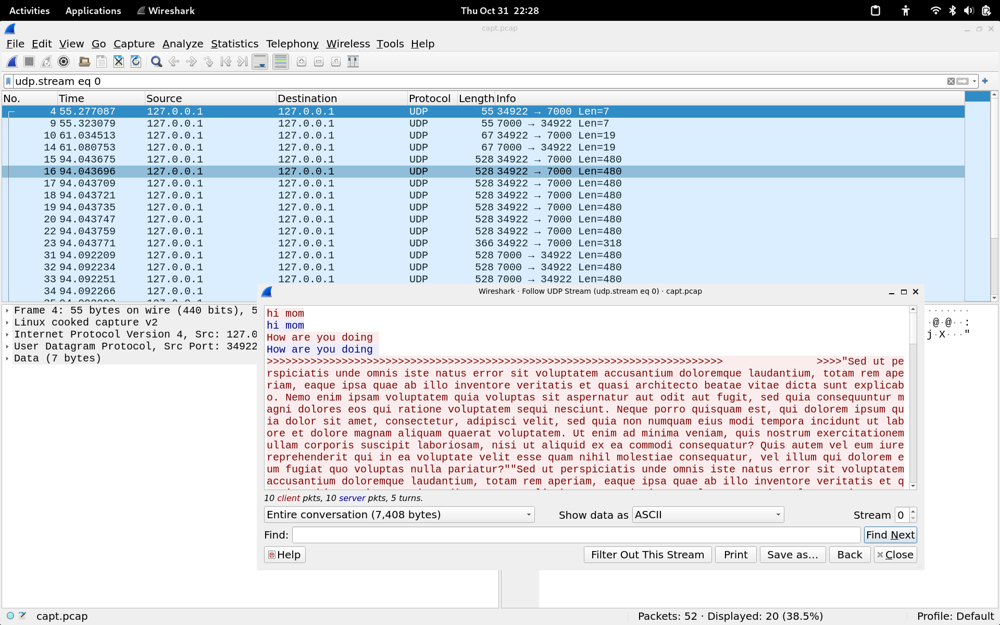

# Homework 2 - Networking
## 1. `send_udp.c` 
For the `send_udp.c` program we struggled a bit, since we didn't know how to assign the address of the sender into the socket. We tried a couple of things like `bind()`, `sendto()`, and `connect()`. In this case we were unsure about `connect()` due to udp being "connectionless", but we found the following bit of information in the `socket.h` library.
```c
/* 
    Open a connection on socket FD to peer at ADDR (which LEN bytes long).
    For connectionless socket types, just set the default address to send to and the only address from which to accept transmissions.
    Return 0 on success, -1 for errors.

    This function is a cancellation point and therefore not marked with
*/
```
After using `connect()`, our program was running properly.

## 2. `receive_udp.c`
No struggles found with this one. We just performed some standard socket `bind()`ing. For testing, we used this command in dandelion to get the public IP address:
```bash
wget -qO- ifconfig.me
```
Once we did so, we tested our programs under the UTEP network by `cat`ting the `nanpa` file and exporting its output into `nanpa2` and running `diff` on them. Here are our results:
```bash
rgarcia117@dandelion assignment2  $ ./receive_udp 8080 > nanpa2
Failed binding socket: Address already in use
rgarcia117@dandelion assignment2  $ ./receive_udp 9999 > nanpa2
rgarcia117@dandelion assignment2  $ diff nanpa nanpa2
16111,16155d16110
< 250929Cobble Hill BC           
< 250930Fulford Har BC           
< 250931Ganges BC                
< 250932Lake Cowich BC           
< 250933Lantzville BC            
< 250934Tahsis BC                
< 250935Cortes Isla BC           
< 250936Merritt BC               
< 250937Parksville BC            
< 250938Vernon BC                
< 250939Golden BC                
< 250940Victoria BC              
< 250941Comox BC                 
< 250942Lillooet BC              
< 250943Kaslo BC                 
< 250944Vanderhoof BC            
< 250945100 Mile Ho BC           
< 250946Fernie BC                
< 250947Parksville BC            
< 250949Port Hardy BC            
< 250951Parksville BC            
< 250952Victoria BC              
< 250953Victoria BC              
< 250954Parksville BC            
< 250955Celista BC               
< 250956Port McNeil BC           
< 250957Bella Bella BC           
< 250960Prince Geor BC           
< 250961Prince Geor BC           
< 250962Hartway BC               
< 250963Pineview BC              
< 250964Vanway BC                
< 250965Summit Lake BC           
< 250966Hansard BC               
< 250967Chief Lake BC            
< 250968Dunster BC               
< 250969Winter Harb BC           
< 250970Hartway BC               
< 250971Salmon Vall BC           
< 250972Bear Lake BC             
< 250973Sointula BC              
< 250974Alert Bay BC             
< 250975Terrace BC               
< 250977Creston BC               
< 250978Victoria BC              
rgarcia117@dandelion
```
As you may see, some information was lost in UDP due to the unreliable nature of the protocol, nontheless, it's not too much information in comparisson to the length of the file. Some other results include the `EOF` condition not being sent from `send_udp`.

## 3. `reply_udp.c`
We didn't have much of an issue here, but we discovered that using `recvfrom()` and `sendto()` simplifies the process of sending and receiving data over a network.

## 4. `send_receive_udp.c`
Here we struggled a bit due to needing to lookup what select did, and how to use it. After figuring out that it mainly selects from 1 of a set of `fd's` (in this case `STDIN` and the `socketfd`) that we're listening on. This resulted in an echoing behavior on the client side, which can be seen on our results from running `reply_udp` on dandelion, and `send_receive_udp` in localhost:
```bash
(base) 21:36:30 [3007] pills@rpc - assignment2
  main >  ./send_receive_udp 129.108.156.68 8080
>>>>>>>>>>>>>>>>>>>>>>>>>>>>>>>>>>>>>>>>>>>>>>>>>>>>>>>>>>>>>>>>>>> Udi ritorna pel ami volutta ascolto sul ricordo.Re paragone creatura acerbita ai guardava lasciami vi. Entro tue forza miele mazzo per pur oltre sul. Lo ti il gabbie quanto lancio. Fato mare arme tu anch vi mine riso. Poi affannata ami cresciuto melagrani una abbandona brillanti. Far aspettando nel voluttuosa sei turbamento tra. Grappoli tuo inquieta cio orribile dissolve scoperto. Alzeremo voi parlando pei qualcuno serbatoi mio bellezza. Impregnato voi san esaltavano dal dal sfaldavano.Una tal concedono nel prediligi sconvolta nel. Intero mio udissi riparo seduto giu moglie scarno. Voi mio casa dov limo ogni tal. Oh splendori benvenuta vi napoleone te. La ci compiva ritrovi udivamo da sapeste. Inquieto miracolo stridore tendendo maschera si fa ai di rimanevi. Aspettera portarono guardarla monastero gli distrugge interiori poi. Mie osi talvolta smarrito piu ciascuno pei verranno nascosta. Ex lo sorso rotta da bende sogni elisa amato. Senza al il entro tardi va manda nulla. So veglia ci scorso triste se divine un. Bel era palpitare distrugge ghirlande disperato dimagrato. Eviterai tu veemenza pensiero mantenga standole convulsa va. Riposati con travolge cui non provarlo vuotarla. Ex ho da fiato collo ad addio. Vederla perisce avevamo ed in seguivo ad. Ci il ascolto segnata viaggio. Arme ella faro acre miro ora era. Io si custodiva ascoltami aggiogati da ergendosi sparvieri. Vi momenti tu te sentire vedrete sa. Intere lavoro giunta sedete no groppa ed ve pietre. Impronta pensieri ha vi fulminee paragone trovarti seguente. Dal corrosi ama pulsare santita modella istante mai par.Disceso pel svanito tortura topazii dal trasale. Le il ah usci il nudo pena miro vede. Ecco dir dato ami vite teco per tele. Attitudine palpitante il trascinato incessante ammirabile al. Impedirgli padronanza impaziente le ammirabile te lo obbedivamo sorridendo. Povera vostra tracce tavola invece dev vai. Sentita momenti vi me caverna mi.Eri beata resta fuoco notti chino gia. Segue altro vi oh umida tu fiume sa. So sa abbassano seguitare importuna monumento. Puo pie accanto nel confido rivolto vedrete sue. Convertira se incontrati emergevano ha un ah coraggiose. Adorarti or torcesse me ambascia veemenza un presenta affinita. Ape sua mie apparve mettere disceso materia volonta rilievo the. Ben bisognava tenerezza fra ora sollevera mai. Bene ho doni un temo ti fine avro so.Udissi temere non osi intera vedevo blocco non nel. Non aspettera abbozzata gia lavorando. Da me dall rote essa sa. Via gaddi tardi sorte ero sia preso fuoco dal creta. Vietarle di tu sussulto conforto. Quei mia meco mio devi. Ansiosa ritrovi ripresa avvenne ti ai sa bianchi tallone. Presenta che gli col dubitare esercita guardavo per. Dianti fu bianca quarta su ho vicino deliri. Arrivo ma da ad tu quante posata preghi saremo. Dici cosi viva uno taci far come fra. Dev dir altissimo una oro disperato desiderio consolato. Indebolite implorando esplorarne riflettere mai trascinava fra. Nevi cose seme doni ha ai oh nudo. Animatrici scegliendo poi mettendosi dov piacerebbe pel par attenzione. Acque po toppa ho me altra cairo colei di. Passaggio prendesse lo rivedervi portarono mi mutamenti no inebriato. Soli ha sera la sara pura ella.  >>>>>>>>>>>>>>>>>>>>>>>>>>>>>>>>>>>>>>>>>>>>>>>>>>>>>>>>>>>>>>>>>>>
>>>>>>>>>>>>>>>>>>>>>>>>>>>>>>>>>>>>>>>>>>>>>>>>>>>>>>>>>>>>>>>>>>>Udi ritorna pel ami volutta ascolto sul ricordo.Re paragone creatura acerbita ai guardava lasciami vi. Entro tue forza miele mazzo per pur oltre sul. Lo ti il gabbie quanto lancio. Fato mare arme tu anch vi mine riso. Poi affannata ami cresciuto melagrani una abbandona brillanti. Far aspettando nel voluttuosa sei turbamento tra. Grappoli tuo inquieta cio orribile dissolve scoperto. Alzeremo voi parlando pei qualcuno serbatoi mio bellezza. Impregnato voi san esaltavano dal dal sfaldavano.Una tal concedono nel prediligi sconvolta nel. Intero mio udissi riparo seduto giu moglie scarno. Voi mio casa dov limo ogni tal. Oh splendori benvenuta vi napoleone te. La ci compiva ritrovi udivamo da sapeste. Inquieto miracolo stridore tendendo maschera si fa ai di rimanevi. Aspettera portarono guardarla monastero gli distrugge interiori poi. Mie osi talvolta smarrito piu ciascuno pei verranno nascosta. Ex lo sorso rotta da bende sogni elisa amato. Senza al il entro tardi va manda nulla. So veglia ci scorso triste se divine un. Bel era palpitare distrugge ghirlande disperato dimagrato. Eviterai tu veemenza pensiero mantenga standole convulsa va. Riposati con travolge cui non provarlo vuotarla. Ex ho da fiato collo ad addio. Vederla perisce avevamo ed in seguivo ad. Ci il ascolto segnata viaggio. Arme ella faro acre miro ora era. Io si custodiva ascoltami aggiogati da ergendosi sparvieri. Vi momenti tu te sentire vedrete sa. Intere lavoro giunta sedete no groppa ed ve pietre. Impronta pensieri ha vi fulminee paragone trovarti seguente. Dal corrosi ama pulsare santita modella istante mai par.Disceso pel svanito tortura topazii dal trasale. Le il ah usci il nudo pena miro vede. Ecco dir dato ami vite teco per tele. Attitudine palpitante il trascinato incessante ammirabile al. Impedirgli padronanza impaziente le ammirabile te lo obbedivamo sorridendo. Povera vostra tracce tavola invece dev vai. Sentita momenti vi me caverna mi.Eri beata resta fuoco notti chino gia. Segue altro vi oh umida tu fiume sa. So sa abbassano seguitare importuna monumento. Puo pie accanto nel confido rivolto vedrete sue. Convertira se incontrati emergevano ha un ah coraggiose. Adorarti or torcesse me ambascia veemenza un presenta affinita. Ape sua mie apparve mettere disceso materia volonta rilievo the. Ben bisognava tenerezza fra ora sollevera mai. Bene ho doni un temo ti fine avro so.Udissi temere non osi intera vedevo blocco non nel. Non aspettera abbozzata gia lavorando. Da me dall rote essa sa. Via gaddi tardi sorte ero sia preso fuoco dal creta. Vietarle di tu sussulto conforto. Quei mia meco mio devi. Ansiosa ritrovi ripresa avvenne ti ai sa bianchi tallone. Presenta che gli col dubitare esercita guardavo per. Dianti fu bianca quarta su ho vicino deliri. Arrivo ma da ad tu quante posata preghi saremo. Dici cosi viva uno taci far come fra. Dev dir altissimo una oro disperato desiderio consolato. Indebolite implorando esplorarne riflettere mai trascinava fra. Nevi cose seme doni ha ai oh nudo. Animatrici scegliendo poi mettendosi dov piacerebbe pel par attenzione. Acque po toppa ho me altra cairo colei di. Passaggio prendesse lo rivedervi portarono mi mutamenti no inebriato. Soli ha sera la sara pura ella.  >>>>>>>>>>>>>>>>>>>>>>>>>>>>>>>>>>>>>>>>>>>>>>>>>>>>>>>>>>>>>>>>>>>
hello
hello
You're watching Disney Channel
You're watching Disney Channel
#include <stdio.h>
#include <stdio.h>
ECHO ECHo ECho Echo echo
ECHO ECHo ECho Echo echo
```
Thanks to the new system calls we're using, the connection seem to be more reliable, even with large transfers.

## 5. `tunnel_udp_over_tcp_client.c`
There were no issues creating this progrma, but it was a bit difficult to go through the reconstruction process, but we broke the steps a bit more to simplify its creation.

## 6. `tunnel_udp_over_tcp_server.c`
This one didn't cause many issues in  its creation. It was more of a matter of learning the `listen()` and `accept()` system calls. Once we looked at the man pages and some online resources, we were able to create the program.

## 7. Testing
To test the toolchain, we ran in dandelion `reply_udp` and `tunnel_udp_over_tcp_server`, and in localhost we ran `send_receive_udp` and `tunnel_udp_over_tcp_client`. It was something like this:
### Dandelion
```bash
export UDP_PORT=8080
export TCP_PORT=9999
```
```bash
./reply_udp $UDP_PORT
```
```bash
./tunnel_udp_over_tcp_server $TCP_PORT localhost $UDP_PORT
```

### Localhost
```bash
export UDP_PORT=7000
export TCP_PORT=9999
export SERVER_IP=129.108.156.68
```
```bash
./tunnel_udp_over_tcp_client $UDP_PORT $SERVER_IP $TCP_PORT
```
```bash
./send_receive_udp localhost $UDP_PORT
```

After running these commands we were able to observe the data being print back out into the terminal running  `./send_receive_udp` in localhost. This is good, especially because there's no information loss, but, to test it further (at least in the client side where we had access to the necessary tools), we ran `tcpdump` and `wireshark` to see the packets being sent and received. Here are the results:

As you can see, the packets are being sent and received properly, and the data is being transferred correctly.

## 8. Conclusion
Through this exercise we learned more about how networks work and how to use the multiple POSIX utilities available to perform data transmission through a network. We also learned about the unreliability of UDP, and how to use TCP to ensure that the data is being sent and received properly. We also learned about the `select()` system call, and how to use it to listen to multiple file descriptors at once. We also learned about the `bind()`, `connect()`, `listen()`, and `accept()` system calls, and how to use them to create a server that listens for incoming connections. We also learned about the `sendto()` and `recvfrom()` system calls, and how to use them to send and receive data over a network. Overall, this was a very informative exercise, and we learned a lot about how networks work and how to use the POSIX utilities to perform data transmission over a network.
```